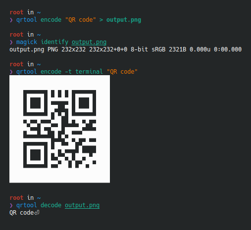
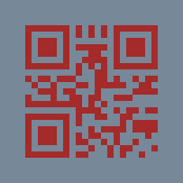

<!--
SPDX-FileCopyrightText: 2022 Shun Sakai

SPDX-License-Identifier: Apache-2.0 OR MIT
-->

# qrtool

[![CI][ci-badge]][ci-url]
[![Version][version-badge]][version-url]
![MSRV][msrv-badge]
![License][license-badge]

**qrtool** is a command-line utility for encoding or decoding QR code.



## Installation

### From source

```sh
cargo install qrtool
```

### Via a package manager

[![Packaging status][repology-badge]][repology-versions]

| OS    | Package manager | Command                               |
| ----- | --------------- | ------------------------------------- |
| _Any_ | [Homebrew]      | `brew install sorairolake/tap/qrtool` |
| _Any_ | [Nix]           | `nix-env -iA nixpkgs.qrtool`          |

### From binaries

The [release page] contains pre-built binaries for Linux, macOS and Windows.

### How to build

Please see [BUILD.adoc].

## Usage

### Basic usage

Encode a string in a QR code:

```sh
qrtool encode "QR code" > output.png
```

Generate this image:


Decode a QR code from this image:

```sh
qrtool decode output.png
```

Output:

```text
QR code
```

### SVG generation

Use `-t` option to change the format of the generated image. The format is
`png` (default), `svg` or `terminal` (to the terminal as UTF-8 string).

```sh
qrtool encode -o output.svg -t svg "QR code"
```

Generate this image:


### Micro QR code generation

Use `--variant` option to change the variant of the generated QR code. The
variant is `normal` (default) or `micro` (Micro QR code).

```sh
qrtool encode -v 3 --variant micro "QR code" > output.png
```

Generate this image:


### Colored output

Use `--foreground` and `--background` options to change the foreground and
background colors of the generated image. These options takes a [CSS color
string] such as `brown`, `#a52a2a` or `rgb(165 42 42)`. The default foreground
color is black and the background color is white of CSS's named colors.

```sh
qrtool encode --foreground brown --background lightslategray "QR code" > output.png
```

Generate this image:



### Supported input image formats

`qrtool decode` supports decoding a QR code from the following image formats:

- [BMP]
- [DDS]
- [Farbfeld]
- [GIF]
- [Radiance RGBE]
- [ICO][][^ico-note]
- [JPEG]
- [OpenEXR]
- [PNG]
- [PNM]
- [QOI]
- [SVG][][^svg-note]
- [TGA]
- [TIFF]
- [WebP]

To support decoding from SVG image, the `decode-from-svg` feature must be
enabled at compile time. Note that the SVG image is rasterized before scanning.

Image formats other than PNG can be disabled by disabling the `default`
feature, and can be enabled individually.

Use `-t` option to specify the image format. If this option is not specified,
the image format is determined based on the extension or the magic number.

Input this WebP image:


Decode a QR code from the WebP image:

```sh
qrtool decode input.webp
# or
qrtool decode -t webp input.webp
```

Output:

```text
QR code
```

[^ico-note]: CUR is also supported.
[^svg-note]: SVGZ is also supported.

### Generate shell completion

`--generate-completion` option generates shell completions to stdout.

The following shells are supported:

- `bash`
- `elvish`
- `fish`
- `nushell`
- `powershell`
- `zsh`

Example:

```sh
qrtool --generate-completion bash > qrtool.bash
```

### Integration with other programs

Both `qrtool encode` and `qrtool decode` can read from stdin and output to
stdout.

#### Optimize the output image

The image output by `qrtool encode` is not optimized. For example, a PNG image
is always output as the 32-bit RGBA format. If you want to reduce the image
size or optimize the image, use an optimizer such as [`oxipng`] or
[`svgcleaner`].

Optimize the output PNG image:

```sh
qrtool encode "QR code" | oxipng - > output.png
```

Optimize the output SVG image:

```sh
qrtool encode -t svg "QR code" | svgcleaner -c - > output.svg
```

#### Reading and writing unsupported image formats

If you want to save the encoded image in an image format other than PNG or SVG,
or decode an image in an unsupported image format, convert it using a converter
such as [ImageMagick].

Read `Cargo.toml` from stdin and save the encoded result as a JPEG XL image:

```sh
cat Cargo.toml | qrtool encode | magick png:- output.jxl
```

Decode this image and print the result using `bat`:

```sh
magick output.jxl png:- | qrtool decode | bat -l toml
```

## Command-line options

Please see the following:

- [`qrtool(1)`]
- [`qrtool-encode(1)`]
- [`qrtool-decode(1)`]
- [`qrtool-help(1)`]

## Changelog

Please see [CHANGELOG.adoc].

## Contributing

Please see [CONTRIBUTING.adoc].

## Acknowledgment

This program is inspired by [`qrencode`] and [`zbarimg`].

## License

Copyright &copy; 2022&ndash;2024 Shun Sakai (see [AUTHORS.adoc])

1. This program is distributed under the terms of either the _Apache License
   2.0_ or the _MIT License_.
2. Some files are distributed under the terms of the _Creative Commons
   Attribution 4.0 International Public License_.

This project is compliant with version 3.0 of the [_REUSE Specification_]. See
copyright notices of individual files for more details on copyright and
licensing information.

[ci-badge]: https://img.shields.io/github/actions/workflow/status/sorairolake/qrtool/CI.yaml?branch=develop&style=for-the-badge&logo=github&label=CI
[ci-url]: https://github.com/sorairolake/qrtool/actions?query=branch%3Adevelop+workflow%3ACI++
[version-badge]: https://img.shields.io/crates/v/qrtool?style=for-the-badge&logo=rust
[version-url]: https://crates.io/crates/qrtool
[msrv-badge]: https://img.shields.io/crates/msrv/qrtool?style=for-the-badge&logo=rust
[license-badge]: https://img.shields.io/crates/l/qrtool?style=for-the-badge
[repology-badge]: https://repology.org/badge/vertical-allrepos/qrtool.svg
[repology-versions]: https://repology.org/project/qrtool/versions
[Homebrew]: https://brew.sh/
[Nix]: https://github.com/NixOS/nixpkgs/blob/master/pkgs/by-name/qr/qrtool/package.nix
[release page]: https://github.com/sorairolake/qrtool/releases
[BUILD.adoc]: BUILD.adoc
[CSS color string]: https://www.w3.org/TR/css-color-4/
[BMP]: https://en.wikipedia.org/wiki/BMP_file_format
[DDS]: https://en.wikipedia.org/wiki/DirectDraw_Surface
[Farbfeld]: https://tools.suckless.org/farbfeld/
[GIF]: https://en.wikipedia.org/wiki/GIF
[Radiance RGBE]: https://en.wikipedia.org/wiki/RGBE_image_format
[ICO]: https://en.wikipedia.org/wiki/ICO_(file_format)
[JPEG]: https://jpeg.org/jpeg/
[OpenEXR]: https://openexr.com/
[PNG]: https://en.wikipedia.org/wiki/PNG
[PNM]: https://netpbm.sourceforge.net/doc/pnm.html
[QOI]: https://qoiformat.org/
[SVG]: https://www.w3.org/Graphics/SVG/
[TGA]: https://en.wikipedia.org/wiki/Truevision_TGA
[TIFF]: https://en.wikipedia.org/wiki/TIFF
[WebP]: https://developers.google.com/speed/webp/
[`oxipng`]: https://github.com/shssoichiro/oxipng
[`svgcleaner`]: https://github.com/RazrFalcon/svgcleaner
[ImageMagick]: https://imagemagick.org/
[`qrtool(1)`]: https://sorairolake.github.io/qrtool/book/man/man1/qrtool.1.html
[`qrtool-encode(1)`]: https://sorairolake.github.io/qrtool/book/man/man1/qrtool-encode.1.html
[`qrtool-decode(1)`]: https://sorairolake.github.io/qrtool/book/man/man1/qrtool-decode.1.html
[`qrtool-help(1)`]: https://sorairolake.github.io/qrtool/book/man/man1/qrtool-help.1.html
[CHANGELOG.adoc]: CHANGELOG.adoc
[CONTRIBUTING.adoc]: CONTRIBUTING.adoc
[`qrencode`]: https://fukuchi.org/works/qrencode/
[`zbarimg`]: https://github.com/mchehab/zbar
[AUTHORS.adoc]: AUTHORS.adoc
[_REUSE Specification_]: https://reuse.software/spec/
